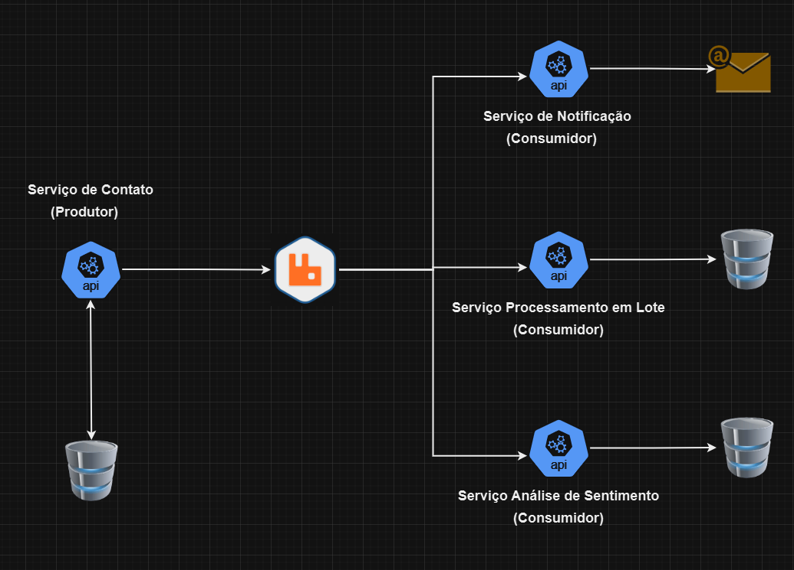

# Tech Challenger - Serviço de Contato

# Introdução

Na fase anterior do Tech Challenge, desenvolvemos um aplicativo .NET para cadastro de contatos regionais, com funcionalidades de adicionar, consultar, atualizar e excluir contatos, utilizando Entity Framework Core ou Dapper para persistência de dados e implementando validações de dados. Além da criação de CI/CD e monitoramento.

Nesta terceira fase, vamos aprimorar o projeto através de microsserviços e comunicação por mensageria. Mantendo também o funcionamento da fase anterior.

# Estudo de caso

Arquitetura proposta para incremento de novas melhorias.

# Microsserviços

- [Serviço Notificação](https://github.com/Jeffconexion/03_Tech_Challenge_Servico_Notificacao)
- [Serviço Processamento em Lote](https://github.com/Jeffconexion/03_Tech_Challenge_Servico_Processamento_Lote)
- [Serviço Análise de Sentimento](https://github.com/Jeffconexion/03_Tech_Challenge_Servico_Analise_Sentimento)

# Serviço de Contato

- **Função**: Este serviço é responsável por manter contato. Ele funciona como o ponto de entrada da aplicação para o processamento de vários requisitos.
- **Processos**:
  - **Serviço Notificação:** Ao adicionar, atualizar e deletar, mensagens são disparadas na fila do RabbitMQ.
  - **Serviço Processamento em Lote:** Novo endpoint disponível para cadastramento em lote, envio para fila do RabbitMQ
  - **Serviço Analise de Sentimento:** Envio de feedbacks para a fila do RabbitMQ.

# Broker (RabbitMQ)

- **Função**: Este é o sistema de mensagens que recebe as informações do serviço de contato e direciona para os consumidores (serviços de processamento, análise de sentimento, e notificações).
- **Processo**:
  - Recebe as mensagens publicadas pelo Serviço de Contato.
  - Encaminha as mensagens para as filas específicas, uma para cada consumidor. Cada consumidor pode ter uma fila dedicada, como `fila-processamento`, `fila-sentimento`, e `fila-notificacoes`.
  - Garante a durabilidade e persistência das mensagens (com configurações de entrega persistente e acknowledgment), para que nenhuma mensagem seja perdida.
- **Tecnologia**: RabbitMQ com filas configuradas para cada serviço consumidor, podendo ter mecanismos de _dead-letter queues_ para mensagens que não puderam ser processadas corretamente.

# Serviço de Notificação

- **Função**: Este serviço é responsável por enviar notificações aos usuários ou responsáveis por contatos com base no adicionar, atualizar e excluir contato.
- **Processo**:
  - Consome mensagens da `fila-notificacoes`.
  - Com base nas informações da mensagem, determina a ação apropriada.
  - Envia emails ou outros tipos de notificação para os usuários ou responsáveis. As mensagens podem ser personalizadas com base no tipo ação.

# Processamento em Lote

- **Função**: Este serviço consome os contatos recebidos e realiza um pré-processamento dos dados, agrupando-os em lotes para melhor performance e organização.
- **Processo**:
  - Recebe mensagens da fila `fila-processamento`.
  - Processa as mensagens em lotes para não sobrecarregar o sistema principal.

# Análise de Sentimento

- **Função**: Este serviço consome feedbacks para análise de sentimentos, processando as mensagens para identificar sentimentos (positivo, negativo, neutro) e insights adicionais.
- **Processo**:
  - Consome mensagens da `fila-sentimento`.
  - Aplica um modelo de Machine Learning ou uma API de processamento de linguagem natural (NLP) para classificar o sentimento das mensagens.
  - Armazena o resultado da análise, incluindo o ID do contato, o texto original e o sentimento detectado, em uma tabela dedicada ou em um banco de dados de análise.
- **Tecnologias**: Bibliotecas de ML (como ML.NET ou integração com APIs de NLP como Azure Cognitive Services), armazenamento em um banco de dados para análises futuras, e uso de relatórios ou painéis para visualização.

# Tecnologias Utilizadas:

- **.NET 8**: Framework para construção da Minimal API.
- **C#**: Linguagem de programação usada no desenvolvimento do projeto.
- **Entity Framework**: ORM (Object-Relational Mapping) utilizado para interagir com o banco de dados.
- **xUnit**: Framework de testes utilizado para realizar testes unitários.
- **SQL Server**: Banco de dados relacional usado para armazenar os dados da aplicação.
- **RabbitMQ**: Broker para o gerenciamento das mensagens.

# Documentação

- [Documentação da API](https://horse-neon-79c.notion.site/Documenta-o-da-API-04183b890d7c47cb89af4445d01d6678?pvs=4)
- [Documentação de Estilo para C#](https://horse-neon-79c.notion.site/Documenta-o-de-Estilo-para-C-de62b229fd01436a96f7a090b4d11e27?pvs=4)
- [Documentação dos Testes](https://horse-neon-79c.notion.site/Documenta-o-dos-Testes-a402a32a16a24b1b925dab83201e7d19?pvs=4)
- [Documentação de Banco de Dados](https://horse-neon-79c.notion.site/Documenta-o-de-Banco-de-Dados-6ba60c4c8533491a9d28da71f6b57c93?pvs=4)
- [Guia de Estrutura do Projeto](https://horse-neon-79c.notion.site/Guia-de-Estrutura-do-Projeto-fbfbc24c616d456bb56306cfda2c0bc9?pvs=4)

# **Checklist de Conclusão de Tarefas**

- [x] Refatorações gerais.
- [x] Refatorar de monolítico para microsserviços.
- [x] Serviços de Contato.
- [x] Serviços de Notificação.
- [x] Serviços de Processamento em Lote.
- [x] Serviço de Análise de Sentimento.
- [x] RabbitMQ como broker.
